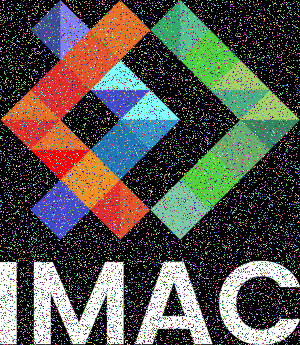
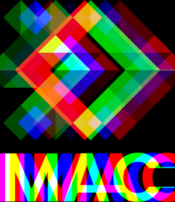
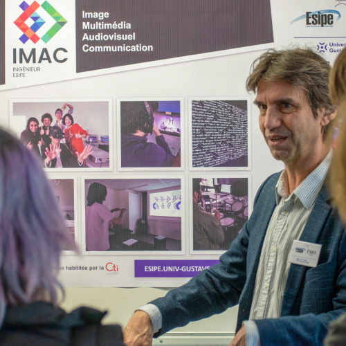
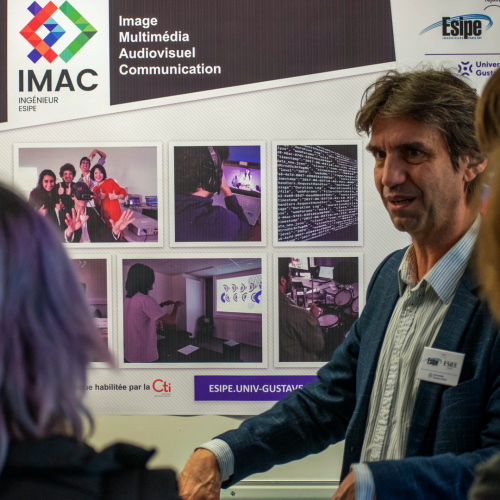
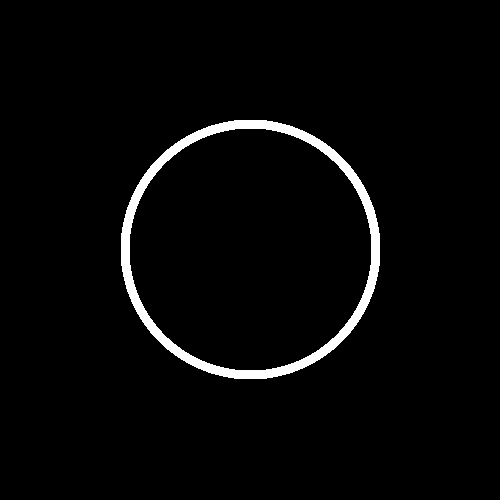
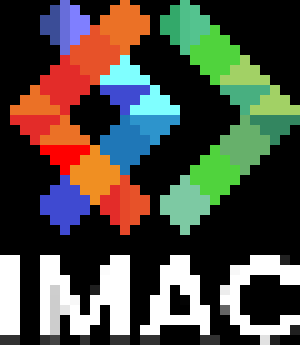
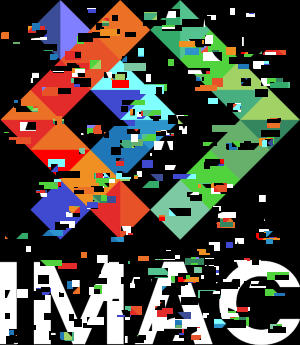
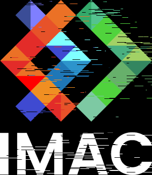

# Workshop prog S1 - Alexandre Grosdidier 

## Objectif 

L'objectif du workshop est de créer différents effets de traitrement d'image en cpp, avec la librairie sil, qui est fournie.

## Effets réalisés 

### Conserver uniquement le vert (only keep green)

### Échange des canaux (swap RGB)

### Niveaux de gris (grayscale)

### Inversion des couleurs (invert)

### Dégradé (gradient)

### Miroir horizontal (flip horizontal)

### Miroir vertical (flip vertical)

### Ajout de bruit (noise)

### Rotation 90° (rotate)

### Décalage RGB (RGB shift)

### Changement de luminosité (brightness)
- Plus clair :   
- Plus sombre : 

### Cercle (circle)

### GIF de cercle (circle animation)
*(non inclus : les frames sont dans `output/gifCircle/` et le gif final n'est pas encore généré)*

### Mosaïque (mosaic)

### Pixelisation (pixelize)

### Effet glitch (glitch)

### Pixel sort (pixel sorting)

### Mosaïque miroir (mirrored mosaic)

### Convolution / Box blur (blur)

### Fractale (fractal)

### Pixelisation (pixelize) *(doublon dans le .hpp)*

