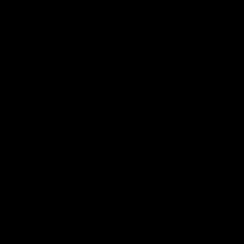

# Workshop prog S1 - Alexandre Grosdidier 

## Objectif 

L'objectif du workshop est de créer différents effets de traitrement d'image en cpp, avec la librairie sil, qui est fournie.

## Effets réalisés 

### Conserver uniquement le vert (only keep green)

Pour faire ceci, j'ai itéré sur chaque pixel et n'ai copié que le channel vert des pixels.

### Échange des canaux (swap RGB)

Ici j'ai échangé le channel rouge et bleu en utilisant la fonction swap

### Niveaux de gris (grayscale)

Pour chaque pixel, j'ai calculé la luminance et mit les channel r,g et b a cette luminance, donnant un niveau de gri

### Inversion des couleurs (invert)

pour chaque channel de chaque pixel, j'ai fait la différence entre 1 et ce channel. Je transforme le 1 en 0 et inversement, inversant donc les couleurs

### Dégradé (gradient)

Pour faire le dégradé, j'ai créé une image vide puis j'ai fait varier la luminance en fonction de la position en x, ce qui donne un dégradé de gauche à droite.

### Miroir horizontal (flip horizontal)

Pour chaque pixel, j'ai copié le pixel situé à la position symétrique sur l'axe horizontal (en inversant la coordonnée y).

### Miroir vertical (flip vertical)

Pour chaque pixel, j'ai copié le pixel situé à la position symétrique sur l'axe vertical (en inversant la coordonnée x).

### Ajout de bruit (noise)

J'ai itéré sur chaque pixel et, avec une probabilité donnée, je remplace le pixel par une couleur aléatoire, sinon je recopie le pixel original.

### Rotation 90° (rotate)

Pour la rotation, j'ai créé une nouvelle image en inversant largeur et hauteur, puis j'ai recopié les pixels en changeant leurs coordonnées pour obtenir une rotation à 90°.

### Décalage RGB (RGB shift)

Pour chaque pixel, j'ai décalé la source du channel rouge vers la gauche et celle du channel vert vers la droite, en clampant les coordonnées pour éviter de sortir de l'image.

### Changement de luminosité (brightness)
- Plus clair :   
- Plus sombre :   
Pour modifier la luminosité, j'applique une correction gamma en utilisant `pow()` sur chaque channel : une puissance < 1 éclaircit l'image, et une puissance > 1 l'assombrit.

### Cercle (circle)

J'ai calculé la distance de chaque pixel au centre de l'image, et j'affiche le pixel en blanc si cette distance est proche du rayon voulu (ce qui dessine un cercle avec une épaisseur).

### GIF de cercle (circle animation)

Pour l'animation, j'ai généré plusieurs images en décalant progressivement la position du cercle à chaque étape, puis j'ai sauvegardé chaque frame.

### Mosaïque (mosaic)

J'ai créé une image plus grande, puis pour chaque pixel j'ai utilisé l'opérateur modulo pour aller chercher le pixel correspondant dans l'image originale, ce qui répète l'image en tuiles.

### Pixelisation (pixelize)

Pour pixeliser, je regroupe les pixels par blocs (ici 10x10) et je copie la couleur du pixel en haut à gauche du bloc sur tous les pixels du bloc.

### Effet glitch (glitch)

J'ai appliqué plusieurs fois un swap entre deux rectangles choisis aléatoirement dans l'image, ce qui crée des "blocs" déplacés et donne l'effet glitch.

### Pixel sort (pixel sorting)

Je choisis des lignes aléatoires, j'extrais un segment de pixels, je les trie selon leur luminance, puis je réécris le segment trié dans l'image pour obtenir l'effet de traînées.

### Mosaïque miroir (mirrored mosaic)

Comme pour la mosaïque, je répète l'image sur une grille, mais j'inverse une tuile sur deux horizontalement et/ou verticalement selon sa position, ce qui crée un motif miroir.

### Convolution / Box blur (blur)

Pour le flou, j'ai appliqué une convolution en prenant, pour chaque pixel (hors bords), la moyenne des pixels dans un carré autour de lui, ce qui lisse l'image.

### Fractale (fractal)
*(pas fonctionnel pour l'instant)*  